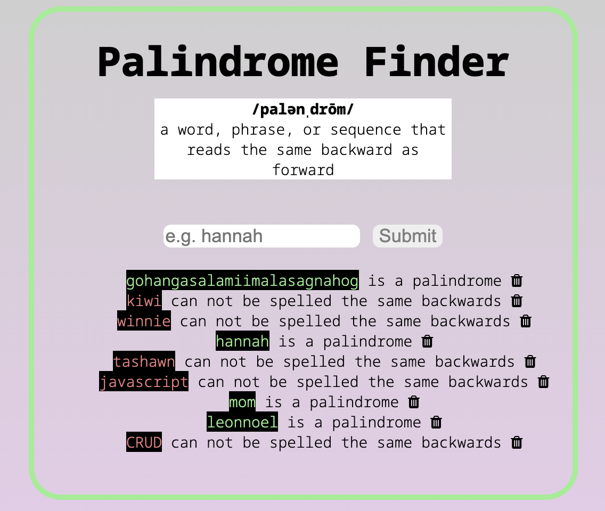

<h1>Palindrome Finder</h1>
I built this project using HTML/CSS, JavaScript, Node.js/Express, and MongoDB. Enter a word and it'll tell you if it's a palindrome or not.
  

<b>Goals:</b>
My goal was to take a previous project I built with only JavaScript and to rebuild it using Node.js/Express.

<b>Results:</b>
This was my first time using CRUD, Node.js/Express, and MongoDB to build a project and it was successful. I learned how to use conditionals on the server side and how to use ESJ templates with beestings. I had fun rebuilding a previous project and learned a lot by improving my code with Node.js/Express. 

## Installation

1. Clone repo
2. run `npm install`

## Usage

1. run `npm run server`
2. Navigate to `localhost:3000`

## Installation

1. Clone repo
2. run `npm install`

## Usage

1. run `npm run server`
2. Navigate to `localhost:2000`
